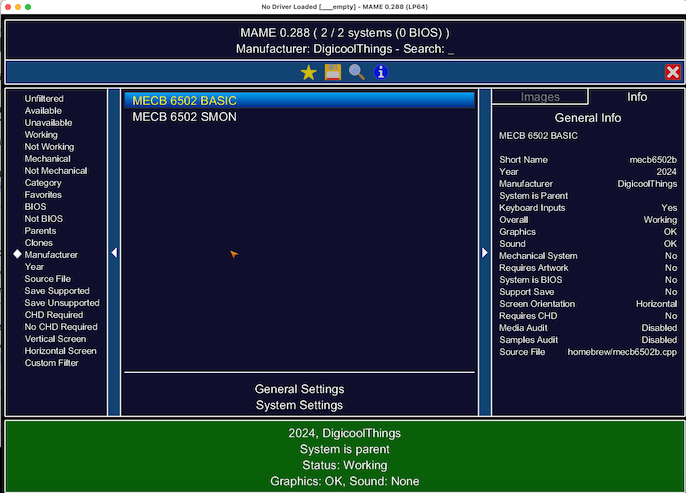
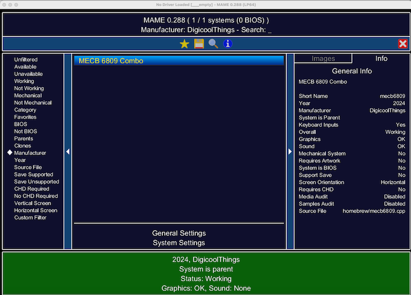

# MAME Customization for MECB 6809

The development machine is a MacMini with i7 Intel processor running MacOS Sonoma 14.7.4.
An updated Homebrew installation is present as are the Xcode Command Line Tools.

Download the latest release of the [MAME source code](https://www.mamedev.org/release.php).
And the epaell git repository containing the [MECB 6809 driver source code](https://github.com/epaell/MECB/tree/main).
```
cd $HOME/git
git clone -b mame0288 --depth 1 https://github.com/mamedev/mame.git mame0288
git clone https://github.com/epaell/MECB.git MECB_epaell

```

Follow the instructions on the [epaell git repository](https://github.com/epaell/MECB/blob/main/MAME/readme.md).
```
export MAMESRC=$HOME/git/MECB_epaell/MAME/
export MAMEDST=$HOME/git/mame0288
cp $MAMESRC/mecb6502.cpp $MAMEDST/src/mame/homebrew/
cp $MAMESRC/mecb6502b.cpp $MAMEDST/src/mame/homebrew/
cp $MAMESRC/mecb6809.cpp $MAMEDST/src/mame/homebrew/
cp -R $MAMESRC/mecb6502 $MAMEDST/roms/
cp -R $MAMESRC/mecb6502b $MAMEDST/roms/
cp -R $MAMESRC/mecb6809 $MAMEDST/roms/
cp $MAMESRC/mame.lst $MAMEDST/src/mame/
cd $MAMEDST
```
I have 2 cores in my CPU so the build command is:
```
make SUBTARGET=mecb6502 SOURCES=src/mame/homebrew/mecb6502.cpp,src/mame/homebrew/mecb6502b.cpp TOOLS=1 REGENIE=1 -j3
make SUBTARGET=mecb6809 SOURCES=src/mame/homebrew/mecb6809.cpp TOOLS=1 REGENIE=1 -j3
```

Running make for the mecb6502 build, make says it found gcc and then it produced compiler errors 
pointing to an unrecognised mac version 11 
and failed preprocessor syntax.
Fixed this by deleting am ancient version of gcc,
after which it found clang and compilation proceeded without error,
apart from deprecation warnings.

A linker error was reported as the SDL3 library was not in the expected place.
Download the .dmg file from the [Simple DirectMedia Layer](https://www.libsdl.org) official site. 
Mount the .dmg file, copy the SDL3.xcframework folder into Library/Frameworks folder.
The make command then proceeded to completion.

Executing MAME customised for 6502, 
produces a running application with the 2 expected drivers.

```
./mecb6502
```


The mecb6809 build proceeded smoothly.
Executing MAME customised for 6809, 
produces a running application with the 1 expected driver.

```
./mecb6809
```
