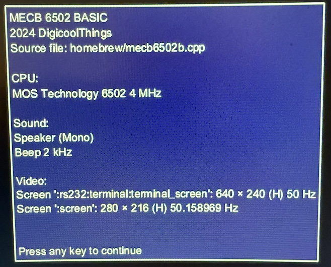
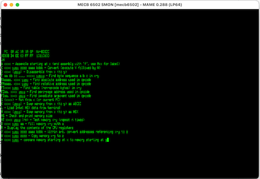
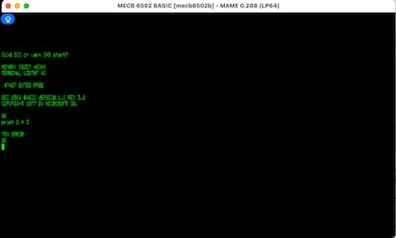
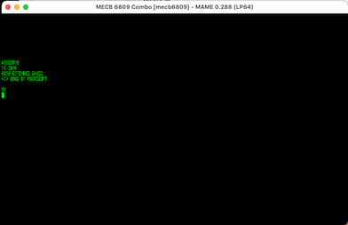

# MAME Usage for MECB 6502 & MECB 6809

Verify correct operation of the customised MAME apps with the supplied ROM files.

The initial splash screen describes the driver 
and the serial communications linkage.




Test with the 6502 SMon ROM file.
```
cd $HOME/git/mame0288
./mecb6502 mecb6502
```
After typing H a screenful of commands is displayed.
For details see: [SMON](https://github.com/dhansel/smon6502/).



Test with the 6502 OSI Basic ROM file.
```
cd $HOME/git/mame0288
./mecb6502 mecb6502b
```


Test with the combined ASSIST09 and Microsoft Basic ROM file.
For details see:
 * [ASSIST09](https://github.com/douggilliland/Retro-Computers/blob/master/6809/LB-6809/assist09/README.md).
 * [Tranter 6809](https://github.com/jefftranter/6809/tree/master/sbc/combined).
 * [MECB epaell](https://github.com/epaell/MECB/blob/main/MECB_6809/ASSIST09/README.md)

 To run Basic use the ASSIST09 command: G C100.
 This causes a break at the line $C100 with a register display.
 It then refuses to execute the Basic ROM assembly.
 However running the MAME debugger at the same time seems to have permanently fixed the problem.
```
cd $HOME/git/mame0288
./mecb6809 mecb6809
# OR
./mecb6809 mecb6809 -debug
```
