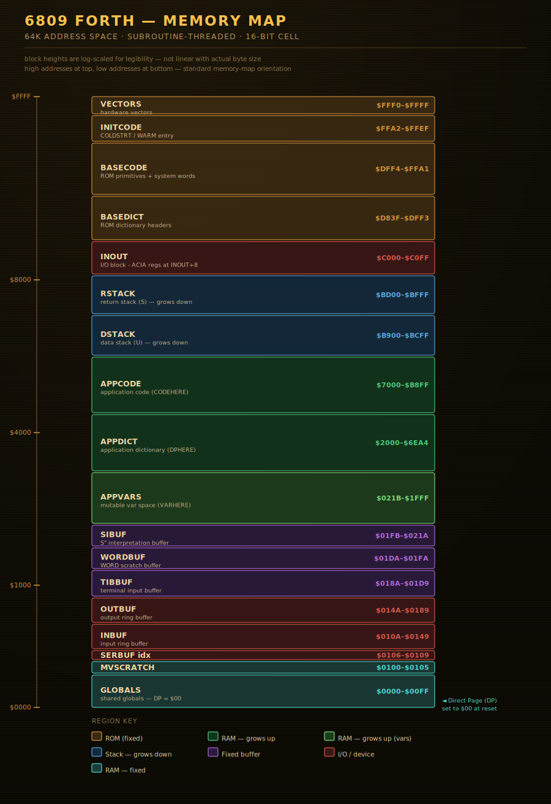

# ClaudeForth
An ANS forth for the MC6809 microprocessor, 
generated using the iPhone Claude app. 

This is a subroutine threaded forth.
It is designed to be ROMable 
and to target the MECB 6809 card computer, 
with the MECB IO card providing an
MC6850 ACIA for serial IO.

## Assets

+ Documentation
+ A unified assembler file.
+ A collection of assembler files
  obtained by splitting the above file.
+ A file listing remaining issues.
+ The ANS test suit.

