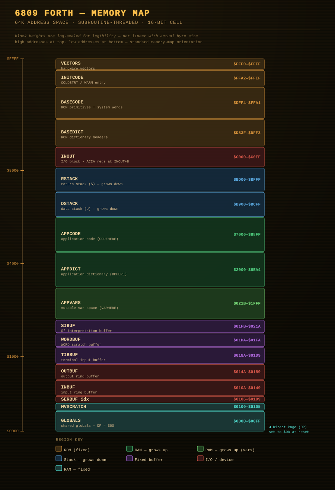

# ClaudeForth
An ANS forth for the MC6809 microprocessor, 
generated using the iPhone Claude app. 

This is a subroutine threaded forth.
It is designed to be ROMable 
and to target the Minimalist Eurocard Board (MECB) 6809 computer, 
with the MECB IO card providing an
MC6850 ACIA for serial IO.

## Development Environment

The development machine is a MacMini with i7 Intel processor running MacOS Sonoma 14.7.4.
An updated Homebrew installation is present as are the Xcode Command Line Tools (Xcode 16.2).
[Homebrew](https://brew.sh) is used to install software dependencies.

```bash
xcode-select --install
/bin/bash -c "$(curl -fsSL https://raw.githubusercontent.com/Homebrew/install/HEAD/install.sh)"
brew install binutils

```


## Progress

| Item             | Completed   |
|:-----------------|------------:|
|Initial specification and code generation|:white_check_mark:|
|Initial documentation|:white_check_mark:|
|Resolve assembler bugs, missing labels and dictionary entries, fix memory map overlaps & gaps. Assembles without errors. |:white_check_mark:|
|Install MAME. Add configuration file for an existing emulated 6809 computer. |:white_check_mark:|
|Customise MAME with the missing mecb6809 and mecb6502 drivers and providing monitor ROM files . |:white_check_mark:|
|Set up serial communications to MAME mecb6809 to allow upload of testing code. |:white_check_mark:|
|Load forth6809.bin rom file and verify memory layout and operation. | |
|Manual tests & tests against ANS test suite. | |
|Develop a simple forth application| |
|Refine the documentation| |

## Assets
### Manifest
+ Documentation
+ A unified assembler file.
+ A collection of assembler files
  obtained by splitting the above file.
+ A file listing remaining issues.
+ The ANS test suit.

### File types
| File extension             | Description of contents   |
|-----------------:|:------------|
|.asm| 6809 assembly language [lwasm syntax](https://www.lwtools.ca)|
|.lst| 6809 assembly listing  |
|.bin| 6809 raw binary opcodes as ROM content |
|.svg| Scalable Vector Graphics text XML format |
|.png| Portable Network Graphics raster image format |
|.pdf| Portable Document Format |
|.docx| Microsoft Word XML format |
|.mmd| [Mermaid](https://mermaid.js.org) graphics text format for UML |


### Documentation

#### Portable Document format

[ClaudeForth Document](https://github.com/rrothwell/ClaudeForth/blob/master/ClaudeForth_preview.pdf)

#### Memory Map



#### MAME Test Harness
1. Chapter 1: [MAME installation notes](https://github.com/rrothwell/ClaudeForth/blob/master/MAME%20installation%20notes.md)
1. Chapter 2: [MAME_Customization](https://github.com/rrothwell/ClaudeForth/blob/master/MAME_Customization.md)
1. Chapter 3: [MAME_Usage](https://github.com/rrothwell/ClaudeForth/blob/master/MAME_Usage.md)
1. Chapter 4: [MAME Serial Communications](https://github.com/rrothwell/ClaudeForth/blob/master/MAME%20Serial%20Communications.md)
1. Chapter 5: [MAME Testing.](https://github.com/rrothwell/ClaudeForth/blob/master/MAME%20Testing.md)


## Plans
1. Assemble and test a bare bones ANS Forth.
1. Scan for refactoring opportunities, removing code duplication.
1. Debugging support.
1. Reorganise dictionary ordering to improved compilation support.
1. Optimised words for common constants.
1. Dictionary vocabulary support.
1. Inbuilt assembler.
1. Forth decompiler.
1. Interrupt chaining to call forth words.
1. Cooperative multitasking.
1. Mass storage support - SD Card or Flash.
1. Application compilation to the ROM area via ROM emulation.


